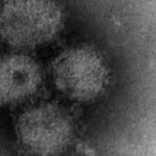

# ddd-edge
this repository contains code and tools for ddd project

# dowload and images
gsutil -m cp -r \
  "gs://ddd_project/dataset-processed/TEM virus dataset/context_virus_1nm_256x256/test" \
  .

# images to test with microscope

